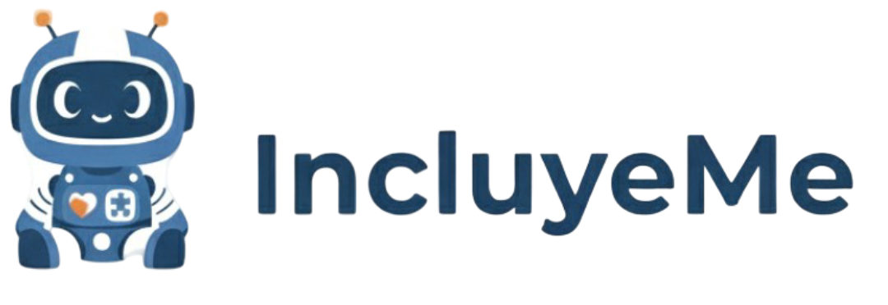

# IncluyeMeApp | Ecosistema de Retención Laboral

<div align="center">
  
</div>

<h3 align="center">
  El primer ecosistema digital de Chile para la retención laboral de personas con discapacidad.
</h3>

<p align="center">
  <a href="#-sobre-el-proyecto"><strong>Sobre el Proyecto</strong></a> ·
  <a href="#-características-principales"><strong>Características</strong></a> ·
  <a href="#-tecnologías-utilizadas"><strong>Tecnologías</strong></a> ·
  <a href="#-iniciando-el-proyecto"><strong>Iniciar</strong></a> ·
  <a href="#-licencia"><strong>Licencia</strong></a>
</p>

---

## 🚀 Sobre el Proyecto

**IncluyeMeApp** nace para abordar una problemática crítica en Chile: más del 56% de los contratos para personas con discapacidad fracasan durante el primer año. Nuestro objetivo no es solo la inclusión, sino la **retención**.

Para ello, hemos diseñado el primer ecosistema digital que conecta en tiempo real al **trabajador**, su **red de apoyo** (familia, cuidadores) y la **empresa**, a través de una plataforma multiparte. Buscamos reducir la deserción laboral y garantizar el éxito a largo plazo de la inclusión.

Este repositorio contiene el código fuente de la página web principal del proyecto, donde se presenta la visión, la solución y se gestionan las donaciones para el desarrollo del Producto Mínimo Viable (MVP).

## ✨ Características Principales

La plataforma completa está diseñada para ofrecer:

*   **🤖 Apoyo a la Autonomía:** Herramientas digitales para la gestión de rutinas, desarrollo de habilidades psicosociales y fomento de la vida independiente del trabajador.
*   **🤝 Acompañamiento Multiparte:** Un sistema de conexión en tiempo real, seguro y coordinado entre la persona, su familia, el empleador y especialistas de apoyo.
*   **⚖️ Cumplimiento Normativo Accesible:** Digitalización y fácil acceso a los protocolos de las **Leyes 21.015 y Karín**, con canales seguros para la prevención y denuncia de acoso.
*   **🧠 Módulo de Salud Mental:** Herramientas de primeros auxilios psicológicos, manejo del estrés y registro del estado emocional para abordar una de las principales causas de deserción.
*   **🧬 Perfiles de Adaptabilidad:** Personalización de la plataforma para distintos tipos y grados de discapacidad (cognitiva, motora, sensorial), asegurando una experiencia de usuario universal.

## 🛠️ Tecnologías Utilizadas

Este proyecto está construido con tecnologías modernas, enfocadas en el rendimiento, la escalabilidad y una excelente experiencia de desarrollo.

*   **[Next.js](https://nextjs.org/)** - Framework de React para producción.
*   **[React](https://react.dev/)** - Biblioteca para construir interfaces de usuario.
*   **[TypeScript](https://www.typescriptlang.org/)** - JavaScript con sintaxis para tipos.
*   **[Tailwind CSS](https://tailwindcss.com/)** - Framework de CSS "utility-first".
*   **[Lucide React](https://lucide.dev/)** - Biblioteca de íconos simple y hermosa.
*   **[Swiper.js](https://swiperjs.com/)** - Carrusel táctil para móviles.
*   **[Vercel](https://vercel.com/)** - Plataforma de despliegue.

## 🏁 Iniciando el Proyecto

Sigue estos pasos para tener una copia local del proyecto funcionando.

### Prerrequisitos

Asegúrate de tener instalado Node.js (versión 18.x o superior).
*   `node -v`

### Instalación

1.  Clona el repositorio:
    ```sh
    git clone https://github.com/Delnr91/IncluyeMe.git
    cd IncluyeMe
    ```

2.  Instala las dependencias del proyecto:
    ```sh
    npm install
    ```

3.  Crea un archivo de variables de entorno local. Copia `.env.example` a `.env.local` y añade las URLs necesarias (si las hay).
    ```sh
    cp .env.example .env.local
    ```
    Por ejemplo, para el webhook de donaciones:
    ```
    NEXT_PUBLIC_MAKE_WEBHOOK_URL=TU_URL_DE_MAKE_COM
    ```

4.  Ejecuta el servidor de desarrollo:
    ```sh
    npm run dev
    ```

Abre http://localhost:3000 en tu navegador para ver el resultado.

## 🤝 Contribuciones

Las contribuciones son lo que hace a la comunidad de código abierto un lugar increíble para aprender, inspirar y crear. Cualquier contribución que hagas será **muy apreciada**.

Si tienes una sugerencia para mejorar esto, por favor haz un fork del repositorio y crea una pull request. También puedes abrir un issue con la etiqueta "enhancement".

1.  Haz un Fork del Proyecto.
2.  Crea tu Feature Branch (`git checkout -b feature/AmazingFeature`).
3.  Haz Commit de tus cambios (`git commit -m 'Add some AmazingFeature'`).
4.  Haz Push a la Branch (`git push origin feature/AmazingFeature`).
5.  Abre una Pull Request.

## 📄 Licencia

Distribuido bajo la Licencia MIT. Consulta el archivo `LICENSE` para más información.

## 📧 Contacto

**Isabeu Valverde** - CEO & Founder
**Daniel Núñez**    - CTO & Co-Founder

**Email:** incluyemeapp@gmail.com

**Enlace del Proyecto:** https://github.com/Delnr91/IncluyeMe

---

<p align="center">Construido con 💚 para un Chile más inclusivo.</p>